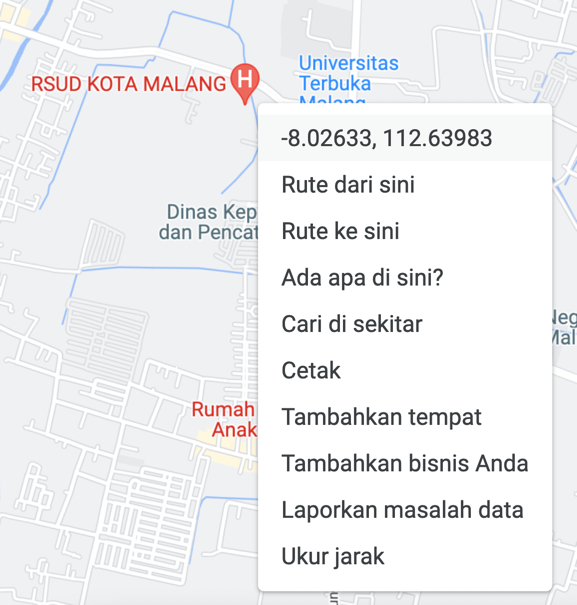

# Java Get Nearest Location

Core logic to get nearest location from list by latitude and longitude and build using java 11

### Result

### Note
How to get latitude and longitude from Google Maps :
1. right click at the point you want to get latitude and longitude
   
2. click the coordination number and the coordination number will be automatically copy into your clipboard

### Source
[ourcodeworld(author:Carlos Delgado)](https://ourcodeworld.com/articles/read/1019/how-to-find-nearest-locations-from-a-collection-of-coordinates-latitude-and-longitude-with-php-mysql)
